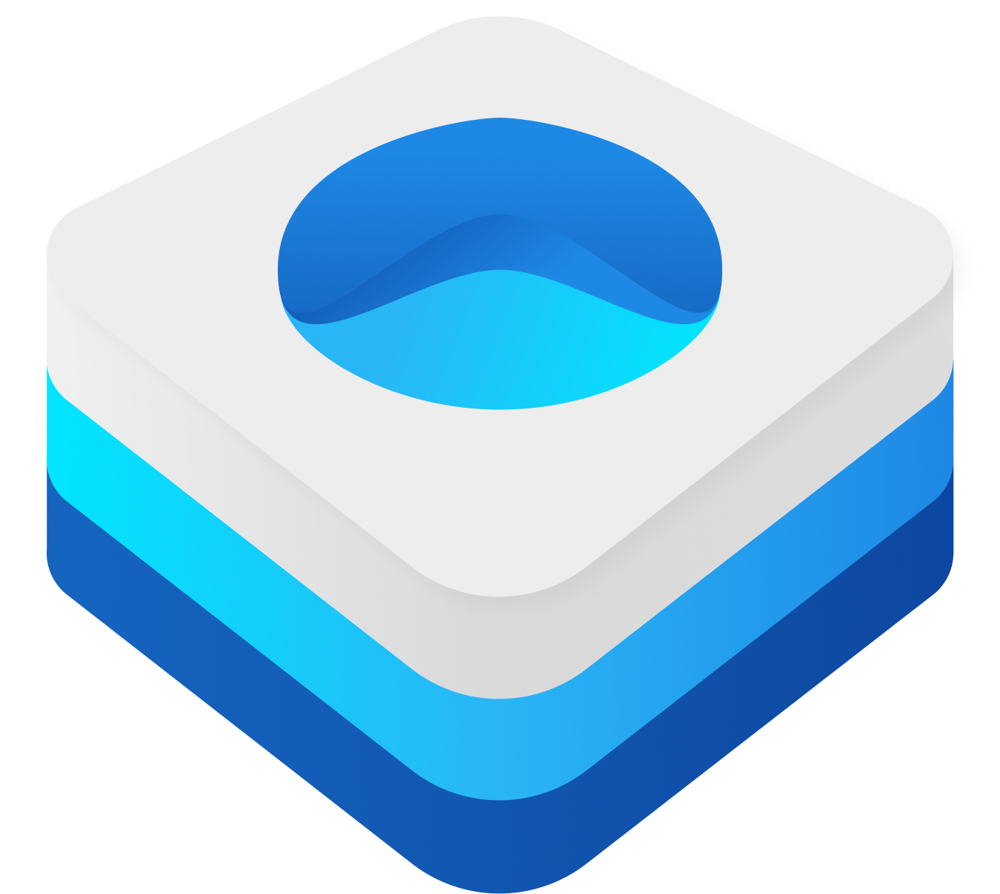

 

# Ignition

`Ignition` aims to help make your SwiftUI views feel more interactive. It does this by providing API that makes it easier to run animations.

> Built for performance and backwards compatibility using [Engine](https://github.com/nathantannar4/Engine)

## See Also

- [Turbocharger](https://github.com/nathantannar4/Turbocharger)
- [Transmission](https://github.com/nathantannar4/Transmission)

## Preview

https://github.com/nathantannar4/Ignition/assets/15272998/0d7b97a0-bf3a-4c07-9a00-b237408f49a4

## Requirements

- Deployment target: iOS 13.0, macOS 10.15, tvOS 13.0, watchOS 6.0 or visionOS 1.0
- Xcode 16.4+

## Installation

### Xcode Projects

Select `File` -> `Swift Packages` -> `Add Package Dependency` and enter `https://github.com/nathantannar4/Ignition`.

### Swift Package Manager Projects

You can add `Ignition` as a package dependency in your `Package.swift` file:

```swift
let package = Package(
    //...
    dependencies: [
        .package(url: "https://github.com/nathantannar4/Ignition"),
    ],
    targets: [
        .target(
            name: "YourPackageTarget",
            dependencies: [
                .product(name: "Ignition", package: "Ignition"),
            ],
            //...
        ),
        //...
    ],
    //...
)
```

## Documentation

Detailed documentation is available [here](https://swiftpackageindex.com/nathantannar4/Ignition/main/documentation/ignition).

## Effects

`Ignition` provides 5 built in effects, but you can also make your own by conforming to the `ViewEffect` protocol.

```swift
/// The style for ``ViewEffectModifier``
@available(iOS 14.0, macOS 11.0, tvOS 14.0, watchOS 7.0, *)
public protocol ViewEffect: DynamicProperty {

    associatedtype Body: View
    @MainActor @ViewBuilder func makeBody(configuration: Configuration) -> Body

    typealias Configuration = ViewEffectConfiguration
}

/// The configuration parameters for ``ViewEffect``
@frozen
@available(iOS 14.0, macOS 11.0, tvOS 14.0, watchOS 7.0, *)
public struct ViewEffectConfiguration {

    /// A type-erased content of a ``ViewEffectModifier``
    public struct Content: ViewAlias { }
    public var content: Content

    /// An opaque identifier to the transaction of a triggered ``ViewEffect``
    public struct ID: Hashable { }
    public var id: ID

    public var isActive: Bool
    public var progress: Double
}
```

### Concatenating Effects

Multiple effects can be concatenating together, for example: `.scale.concat(.offset)`

```swift
@available(iOS 14.0, macOS 11.0, tvOS 14.0, watchOS 7.0, *)
extension ViewEffect {

    /// A ``ViewEffect`` that concatenates an additional ``ViewEffect``
    public func concat<ConcatenatingEffect: ViewEffect>(
        _ effect: ConcatenatingEffect
    ) -> ConcatenatedViewEffect<Self, ConcatenatingEffect> where Self: ViewEffect
}
```

### Triggering Effects

Effects can be triggered via the `OnChangeViewEffectModifier` or the `ScheduledViewEffectModifier`.

```swift
@available(iOS 14.0, macOS 11.0, tvOS 14.0, watchOS 7.0, *)
extension View {

    /// Adds a ``ViewEffect`` animation to a view that runs when the value changes
    @_disfavoredOverload
    @inlinable
    public func changeEffect<
        Effect: ViewEffect,
        Value: Equatable
    >(
        _ effect: Effect,
        value: Value,
        animation: Animation,
        isEnabled: Bool = true
    ) -> some View

    /// Adds a ``ViewEffect`` animation to a view that runs on an interval
    @_disfavoredOverload
    @inlinable
    public func scheduledEffect<
        Effect: ViewEffect
    >(
        _ effect: Effect,
        interval: TimeInterval,
        animation: Animation,
        isEnabled: Bool = true
    ) -> some View {
        scheduledEffect(
            effect,
            interval: interval,
            animation: .continuous(animation),
            isEnabled: isEnabled
        )
    }
}
```

### BackgroundViewEffect

```swift
@available(iOS 14.0, macOS 11.0, tvOS 14.0, watchOS 7.0, *)
extension ViewEffect {

    /// A ``ViewEffect`` that emits a view in the background
    public static func background<Content: View>(
        alignment: Alignment = .center,
        @ViewBuilder _ content: () -> Content
    ) -> BackgroundViewEffect<Content> where Self == BackgroundViewEffect<Content>
}
```

### OverlayViewEffect

```swift
@available(iOS 14.0, macOS 11.0, tvOS 14.0, watchOS 7.0, *)
extension ViewEffect {

    /// A ``ViewEffect`` that emits a view in the foreground
    public static func overlay<Content: View>(
        alignment: Alignment = .center,
        @ViewBuilder _ content: () -> Content
    ) -> OverlayViewEffect<Content> where Self == OverlayViewEffect<Content>
}
```

### OffsetViewEffect

```swift
@available(iOS 14.0, macOS 11.0, tvOS 14.0, watchOS 7.0, *)
extension ViewEffect where Self == OffsetViewEffect {

    /// A ``ViewEffect`` that moves the view between an offset
    public static var offset: OffsetViewEffect

    /// A ``ViewEffect`` that moves the view between an offset
    public static func offset(x: CGFloat) -> OffsetViewEffect

    /// A ``ViewEffect`` that moves the view between an offset
    public static func offset(y: CGFloat) -> OffsetViewEffect

    /// A ``ViewEffect`` that moves the view between an offset
    public static func offset(offset: CGPoint) -> OffsetViewEffect
}
```

### RotationViewEffect

```swift
@available(iOS 14.0, macOS 11.0, tvOS 14.0, watchOS 7.0, *)
extension ViewEffect where Self == RotationViewEffect {

    /// A ``ViewEffect`` that rotates the view by an angle
    public static var rotate: RotationViewEffect

    /// A ``ViewEffect`` that rotates the view by an angle
    public static func rotate(angle: Angle, anchor: UnitPoint = .center) -> RotationViewEffect
}
```

### ScaleViewEffect

```swift
@available(iOS 14.0, macOS 11.0, tvOS 14.0, watchOS 7.0, *)
extension ViewEffect where Self == ScaleViewEffect {

    /// A ``ViewEffect`` that scales a view between a size
    public static var scale: ScaleViewEffect

    /// A ``ViewEffect`` that scales a view between a size
    public static func scale(width: CGFloat, anchor: UnitPoint = .center) -> ScaleViewEffect

    /// A ``ViewEffect`` that scales a view between a size
    public static func scale(height: CGFloat, anchor: UnitPoint = .center) -> ScaleViewEffect

    /// A ``ViewEffect`` that scales a view between a size
    public static func scale(scale: CGFloat, anchor: UnitPoint = .center) -> ScaleViewEffect

    /// A ``ViewEffect`` that scales a view between a size
    public static func scale(scale: CGSize, anchor: UnitPoint = .center) -> ScaleViewEffect
}
```

### ButtonStyle

Want to run an effect when a user presses a button? Try using the `.changeEffect` button style.

```swift
@available(iOS 14.0, macOS 11.0, tvOS 14.0, watchOS 7.0, *)
extension PrimitiveButtonStyle {

    /// A ``PrimitiveButtonStyle`` that runs a ``ViewEffect`` when pressed
    public static func changeEffect<Effect: ViewEffect>(
        effect: Effect
    ) -> ViewEffectButtonStyle<Effect> where Self == ViewEffectButtonStyle<Effect>
}
```
